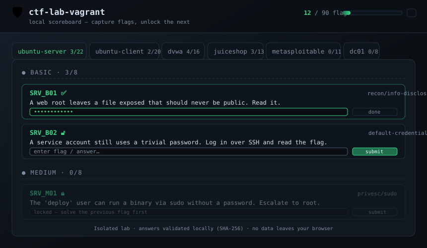

<!-- markdownlint-disable MD033 MD041 -->
<h1 align="center">🛡️ ctf-lab-vagrant</h1>

<p align="center">
  <strong>A self-built, reproducible penetration-testing & CTF lab.</strong><br>
  Multi-VM range provisioned as code, with 90 flags across Basic / Medium / Hard and a
  custom local scoreboard that validates captured flags and gates your progress.
</p>

<p align="center">
  
  
  
  
  
  
</p>

<p align="center"></p>

---

> ### ⚠️ Ethics & Authorization
> Every machine in this lab is **intentionally vulnerable**. The entire range runs on an
> **isolated, host-only virtual network (`192.168.56.0/24`) with no internet exposure**.
> This project is for learning offensive security on systems I own. **Never** deploy these
> configurations on a public, corporate, or production network, and only test systems you
> are authorized to test.

---

## Why I built this

I wanted to learn offensive security the way it is actually practiced: by **building the
targets myself**, breaking them, and then documenting the fix. The whole environment is
infrastructure-as-code — `vagrant up` reproduces it from scratch on any machine — and the
scoreboard turns the lab into a guided, self-graded CTF.

**What this project demonstrates**

- **Infrastructure-as-code** — a single multi-VM `Vagrantfile` on a segmented host-only network.
- **Provisioning & automation** — Bash + PowerShell scripts that create realistic vulnerabilities and plant flags deterministically.
- **Breadth of security knowledge** — web app, network/service, Linux privilege escalation, and Active Directory attack paths.
- **From-scratch tooling** — a dependency-free (Python standard library) scoreboard web app.
- **The defensive half** — every vulnerability ships with a remediation note. Breaking things is only half the job.

---

## Architecture

| Machine          | IP              | Role                          | Flag focus                         |
|------------------|-----------------|-------------------------------|------------------------------------|
| `kali`           | 192.168.56.10   | Attacker workstation          | — (tooling)                        |
| `ubuntu-server`  | 192.168.56.30   | Custom Linux target           | Services + privilege escalation    |
| `ubuntu-client`  | 192.168.56.31   | Custom Linux workstation      | Local privesc + misconfiguration   |
| `dvwa`           | 192.168.56.21   | Damn Vulnerable Web App       | SQLi, XSS, CSRF, file upload, LFI  |
| `juiceshop`      | 192.168.56.22   | OWASP Juice Shop              | Modern web / OWASP Top 10          |
| `metasploitable` | 192.168.56.20   | Metasploitable-style host     | Service exploitation, legacy CVEs  |
| `dc01`           | 192.168.56.40   | Windows AD Domain Controller  | Kerberos, AD ACLs, credential abuse|

Full network diagram and design rationale: **[docs/architecture.md](docs/architecture.md)**.

The lab is built in **phases** so it is always in a working, demonstrable state:

- **Phase 1 (current):** scoreboard + `ubuntu-server`, `ubuntu-client`, `dvwa`, `juiceshop`.
- **Phase 2:** `metasploitable` (service exploitation).
- **Phase 3:** `dc01` Windows Active Directory (heaviest; see [docs/known-issues.md](docs/known-issues.md)).

---

## Quick start

**Prerequisites:** [VirtualBox](https://www.virtualbox.org/) 7.x and [Vagrant](https://www.vagrantup.com/) 2.4+.

```bash
# 1. Clone
git clone https://github.com/goldenmiragee/ctf-lab-vagrant.git
cd ctf-lab-vagrant

# 2. Generate flag artifacts (uses the redacted example answers unless you supply your own)
python generate.py

# 3. Bring up the Phase 1 targets (host-only network, no internet exposure)
vagrant up ubuntu-server ubuntu-client dvwa juiceshop

# 4. Start the scoreboard (auto-picks a free port, binds to 127.0.0.1 only)
cd scoreboard
python server.py
#   -> open the printed http://127.0.0.1:<port> in your browser
```

**Reset a single box to a clean state:**

```bash
vagrant destroy -f ubuntu-server && vagrant up ubuntu-server
```

**Tear the whole lab down:** `vagrant destroy -f`

---

## The scoreboard

A dependency-free web app (Python standard-library HTTP server + vanilla HTML/CSS/JS).

- A **tab per machine**, and within each, three **level tracks** — Basic / Medium / Hard.
- Submit a flag → it is **SHA-256 hashed in the browser** and compared to the stored hash.
  - ✅ **Correct:** the field turns **green** and the **next flag in that track unlocks**.
  - ❌ **Wrong:** the field turns **red** and the next flag **stays locked**.
- Progress is saved in `localStorage`, so it survives restarts.
- Optional per-flag hints are one click away.

> **Security note (by design):** the scoreboard binds to `127.0.0.1` and has **no
> authentication** — appropriate for a personal, local lab, and called out here so it is a
> conscious choice rather than an accidental exposure. Do not bind it to `0.0.0.0`.

---

## Flags — 90 total (30 Basic · 30 Medium · 30 Hard)

<details>
<summary><strong>How flags work (planted vs. derived, and why answers aren't in this repo)</strong></summary>

<br>

Flags come in two kinds:

- **Planted** (on the two custom Ubuntu boxes): the provisioning scripts *create* the
  vulnerability and write a `FLAG{...}` token you capture. 42 of the 90 flags are planted.
- **Derived** (on DVWA / Juice Shop / Metasploitable / the DC): the "flag" is a value you
  *extract* by exploiting the target — a password, a hash, a CVE id, a config value.

**Answers are never committed.** The repo contains only SHA-256 hashes
(`scoreboard/flags.json`). The plaintext master (`flags_source.py`), the human-readable
`answers-key.md`, and the provisioning `provision/flags.env` are all **git-ignored**. A
redacted `flags_source.example.py` *is* committed so a fresh clone still builds a working
(placeholder-flag) lab — run `python generate.py` and it falls back to the example
automatically. To play the real challenge, keep your private `flags_source.py`.

</details>

| Machine          | Basic | Medium | Hard | Total |
|------------------|:-----:|:------:|:----:|:-----:|
| `ubuntu-server`  |   8   |   8    |  6   |  22   |
| `ubuntu-client`  |   8   |   7    |  5   |  20   |
| `dvwa`           |   6   |   6    |  4   |  16   |
| `juiceshop`      |   3   |   4    |  6   |  13   |
| `metasploitable` |   4   |   3    |  4   |  11   |
| `dc01`           |   1   |   2    |  5   |   8   |
| **Total**        | **30**| **30** |**30**| **90**|

Vulnerability classes span default credentials, information disclosure, SQLi/XSS/CSRF,
file-upload bypass, SSRF/XXE/NoSQLi, SUID/sudo/cron/capabilities/`LD_PRELOAD` privilege
escalation, container & namespace escapes, service CVEs, and Active Directory attacks
(AS-REP roasting, Kerberoasting, DCSync, golden ticket, ACL abuse).

---

## 📓 Testing log — what worked, what didn't

Honest notes from building and attacking each box — including what broke and how I fixed it.

**Phase 1 — verified on live VMs** (VirtualBox 7.2.6, Vagrant 2.4.9):

| Target          | What I verified                                        | Result   | Notes                                                             |
|-----------------|--------------------------------------------------------|:--------:|-------------------------------------------------------------------|
| ubuntu-server   | `vagrant up` + provisioning end-to-end                 | ✅       | Boots on the host-only net; services provision cleanly            |
| ubuntu-server   | Planted flags hash-match the scoreboard                | ✅       | Verified web-root, MOTD, sudo, NFS, docker-group, MySQL flags     |
| all planted     | Captured flag value == `flags.json` hash               | ❌ → ✅   | A bash brace-matching bug appended a stray `}` to **every** flag, so none validated. Root-caused to the `${!var:-…}` default, fixed at the helper, re-verified 13 flags. |
| ubuntu-server   | MySQL empty-root flag seed                             | ❌ → ✅   | First run failed (`No such file or directory`) — seed dir created after the write; reordered `mkdir` and re-verified. |
| ubuntu-client   | `vagrant up` + provisioning end-to-end                 | ✅       | Base image cached from the server build → fast boot               |
| ubuntu-client   | Direct / base64 / XOR-split / cross-host pivot flags    | ✅       | `CLI_B04` base64, `CLI_H05` XOR reconstruction, `SRV_H06` pivot all validate |
| dvwa            | Web app reachable + login page renders                 | ✅       | HTTP 200 at `192.168.56.21`; fixed a DB-auth mismatch (config used the default `p@ssw0rd`) first |
| juiceshop       | App reachable (Dockerised)                             | ✅       | HTTP 200 at `192.168.56.22`; container healthy, `:80→:3000` |

**Pending / upcoming:**

| Target          | Technique                                | Result     | Notes                                    |
|-----------------|------------------------------------------|:----------:|------------------------------------------|
| metasploitable  | Box boots + reachable on host-only net   | ✅ / ⚠️   | Up at `192.168.56.20` (ports 21/22/80/3306; ProFTPD 1.3.5, Apache 2.4.7). **But** it's Metasploitable**3**; the `MSF_*` flags target Metasploitable2 services and need alignment — see [known-issues](docs/known-issues.md). |
| dc01            | Windows Server on VirtualBox 7.2         | _planned_  | Phase 3 — build stability tracked in known-issues |

Detailed per-level writeups live in **[docs/walkthroughs/](docs/walkthroughs/)**.

---

## Remediation notes

Every vulnerability class in the lab is paired with its defensive fix in
**[docs/remediation.md](docs/remediation.md)** — because understanding the patch matters as
much as understanding the exploit.

---

## Repository layout

```
ctf-lab-vagrant/
├── Vagrantfile                 # all VMs, host-only network, phased provisioning
├── generate.py                 # builds flags.json / answers-key.md / flags.env
├── flags_source.example.py     # committed, redacted flag template (fallback)
├── flags_source.py             # PRIVATE master with real answers (git-ignored)
├── provision/
│   ├── ubuntu-server.sh        # creates vulns + plants flags (Phase 1)
│   ├── ubuntu-client.sh        # creates vulns + plants flags (Phase 1)
│   ├── dvwa.sh                 # installs DVWA (Phase 1)
│   ├── juiceshop.sh            # installs OWASP Juice Shop via Docker (Phase 1)
│   ├── dc01.ps1                # Windows AD setup (Phase 3)
│   └── flags.env               # PRIVATE planted-flag values (git-ignored)
├── scoreboard/
│   ├── server.py               # stdlib HTTP server, auto free-port, 127.0.0.1 only
│   ├── index.html · app.js · style.css
│   ├── flags.json              # PUBLIC: questions + hints + SHA-256 hashes
│   └── selfcheck.py            # asserts artifact integrity (the one runnable check)
├── docs/                       # architecture, remediation, known-issues, walkthroughs
├── screenshots/
├── answers-key.md              # PRIVATE generated answer key (git-ignored)
├── LICENSE                     # MIT + educational-use notice
└── .gitignore
```

---

## Tech used

`Vagrant` · `VirtualBox` · `Bash` · `PowerShell` · `Python` (standard library only) ·
`HTML` / `CSS` / `JavaScript`

## License

[MIT](LICENSE), with an educational-use notice. Use only on systems you own or are
authorized to test.
